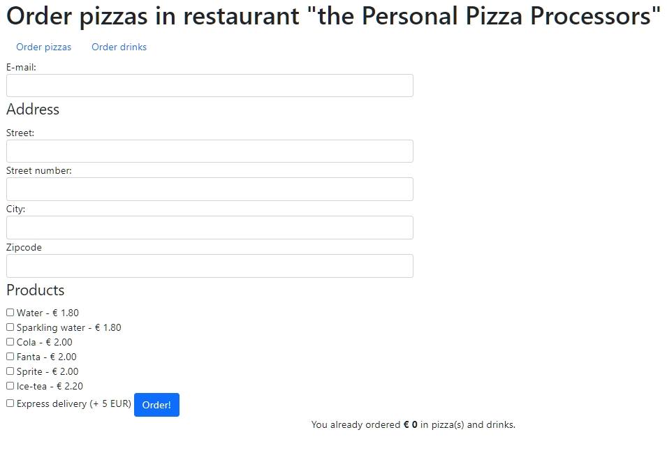

# Deployed here

https://oderform.herokuapp.com/

# Order form

- Repository: `php-order-form`
- Type of Challenge: `Learning challenge`
- Duration: `4 days` 🕓
- Deadline: `23/03 17h00` 🔔
- Deployment strategy : `heroku` ☯️
- Team challenge : `solo with teamplayer spirit` 💞

## Learning objectives
- Be able to tell the difference between the superglobals [**$_GET**](https://www.php.net/manual/en/reserved.variables.get.php), [**$_POST**](https://www.php.net/manual/en/reserved.variables.post.php), [**$_COOKIE**](https://www.php.net/manual/en/reserved.variables.cookies.php) and [**$_SESSION**](https://www.php.net/manual/en/reserved.variables.session.php) variable.
- Be able to write basic validation for PHP.
- Be able to sent an email with PHP

## The Mission

You are hungry, very hungry 🤤. You would like to order some food to fill your empty belly but your favorite pizzaïlo takes many times to answer the phone and he doesn't have a order form on his website. 

With your new PHP powers you offer him to implement a form to record the deliveries and no longer take orders by phone. Of course, he will pay you... with pizzas 🍕

**How will it work in summary?** 

The customer can order various pizzas, and then both the restaurant owner and the customer receive an e-mail with the details of the order.

You will add a counter at the bottom of the page that shows the total amount of money that has been spent on this page for this user.
This counter should keep going up even when the user closes his browser.

You can start modifying `index.php` and `form-view.php`, they already contain some code to help you on your way.

## Required features

### Step 1: Validation 🛂
- Validate that the field e-mail is filled in and a valid e-mail address
- Make sure that the street, street number, city and zipcode is a required field.
- Make sure that street number and zipcode are only numbers.
- After sending the form, when you have errors show them in a nice error box above the form, you can use the [bootstrap alerts](https://getbootstrap.com/docs/5.0/components/alerts/) for inspiration.
    - You do not need to show each error with it's matching field, showing all errors on top of the form is enough for now. You can always come back it later and make it nicer.
- If the form is invalid make sure all the values the user entered are still displayed in the form, so he doesn't need to fill them all in again!
- If the form is valid (for now) just show the user a message above the form that his order has been sent

### Step 2: Make sure the address is saved 📩
Save all the address information as long as the user doesn't close the browser. When he closes the browser it is oké to lose his information.

Prefill the address fields with the saved address.
Should you use a COOKIE 🍪 or a SESSION variable for this?

### Step 3: Switch between drinks and food 🥤 🍕
There are 2 different $product arrays, one with drinks, the other with food. Depending on which link at the top of the page you click, you should be able to order food or drinks (never both).
The food items should be the default.

### Step 4: Calculate the delivery time ⏲️
Calculate the expected delivery time for the product. For normal delivery all orders are fulfilled in 1h, for express delivery it is only 30 minutes.
Add this expected time to the confirmation message.
> If you are wondering: they deliver with drones 🛩️.

### Step 5: Total revenue counter 🧮
Add a counter at the bottom of the page that shows the total amount of money that has been spent on this page from this browser. 
Should you use a COOKIE or a SESSION variable for this?

### Step 6: Send the e-mail 📧
Use the `mail()` function in PHP to send an e-mail with a summary of the order.
The e-mail should contain all information filled in by the user + the total price of all ordered items.
Display the expected delivery time.
Make sure to not forget the extra cost for express delivery!
Sent this e-mail to the user + [a predefined](https://www.php.net/define) e-mail of the restaurant owner.

## Nice to have features
- Change the checkboxes to an input field to accept a quantity.
Change the price calculation and email to support buying multiple items.
- Make it possible to buy both drinks and food in one order. Still have the selections toggleable (no javascript!).
- Change the products to use [Objects](https://www.php.net/manual/en/language.types.object.php) instead of an array.

## Tips
- You can use `filter_var($email, FILTER_VALIDATE_EMAIL)` to filter for e-mails.
- To check if an input is a number you can use `is_numeric($number)`
- If the `mail()` function doesn't work you might need to install [sendmail](https://gist.github.com/adamstac/7462202)
- When you are stuck try to run the function `var_dump()`, it might provide you with information how to access your input data. Or even better: use [xdebug!](https://xdebug.org/)
- Do not use private browsing during this excersise, it will make it more difficult to get everything working.
- You do not set cookies the same way you set other variables. Google how to do it!

## Do they have banana pizzas ? 

